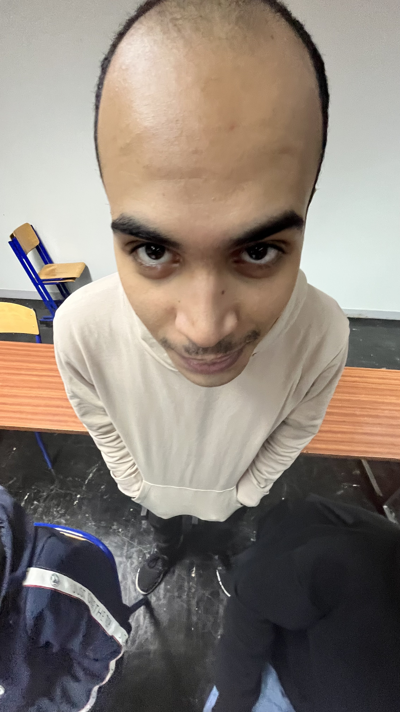
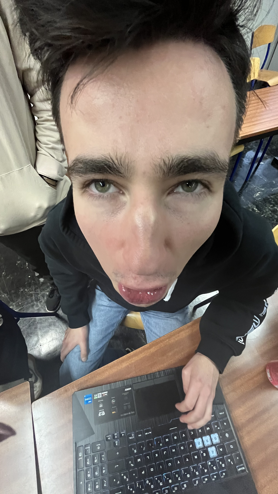
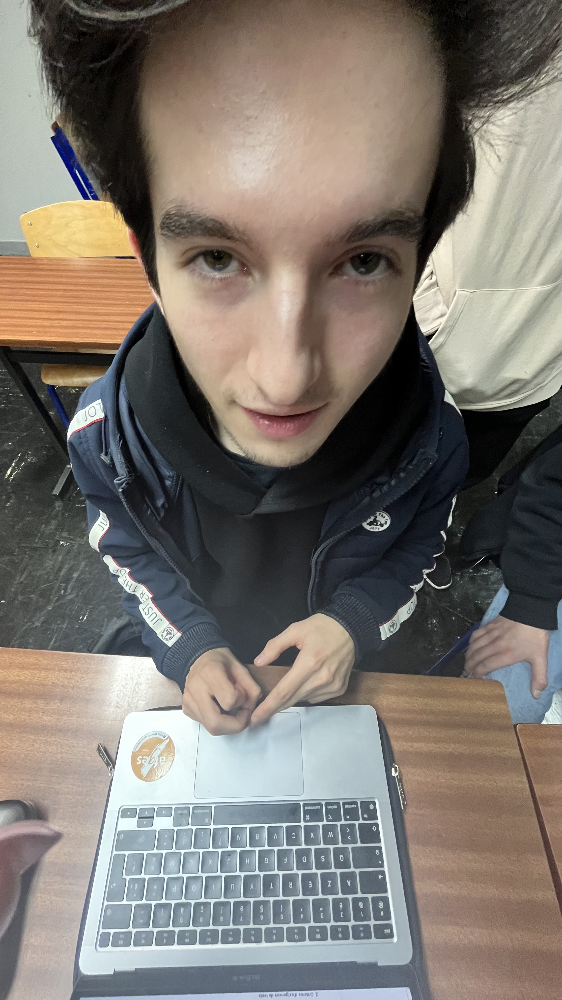

# Crash BandiBooks - T3 Project

## **Présentation**

**Crash BandiBooks** est un jeu sérieux (serious game) qui met en lumière le métier de **Data Librarian** à travers une 
aventure immersive et pédagogique. Le joueur incarne un data librarian, membre d’une équipe de chercheurs envoyés dans 
l’espace pour explorer des planètes, collecter des données sur les minerais et matériaux, et contribuer à la survie de l’humanité.

L'objectif principal est de découvrir une planète viable pour accueillir notre peuple en quête d’un nouveau foyer, 
tout en illustrant les compétences essentielles d'un Data Librarian : **organisation, gestion et analyse des données**.

---

## **Fonctionnalités**

- 🌌 **Exploration spatiale** : Visitez différentes planètes avec des environnements uniques.
- 📊 **Analyse et gestion des données** : Collectez, stockez, analysez, et exploitez les informations découvertes sur 
les matériaux.
- 🏛️ **Salles interactives** : Déplacez-vous entre les différentes salles dédiées à la gestion et à l’analyse des données.
- 🎵 **Univers immersif** : Profitez d’une musique et de graphismes conçus pour plonger le joueur dans l’univers du jeu.

---

## **Captures d'écrans**

**Salle "Bibliothèque"** :
 

 

**Salle "Serveurs"** :
 

 

**Salle "Bureau"** :
 

 

**Salle "Conférences"** :
 

 

**Salle "Laboratoires"** :
 

 

---

## **Licence**

Ce projet est distribué sous la licence **MIT**. Vous êtes libre de l'utiliser, le modifier, et le redistribuer sous 
les conditions de la licence.

---

### Procédures d'installation et d'exécution

#### Windows:

1. Téléchargez le .zip [ici](https://git.unistra.fr/naughty-frog/t3/-/tree/main/Executables/macOS/crash_bandicoot.zip)
2. Décompressez l'archive
3. Executez le .exe

#### Linux:

1. Téléchargez le .zip [ici](https://git.unistra.fr/naughty-frog/t3/-/tree/main/Executables/Linux/crash_bandicoot.zip)
2. Décompressez l'archive
3. le rendre executable (`chmod +x ...`)
4. L'executer

#### MacOS:

1. Téléchargez le .zip [ici](https://git.unistra.fr/naughty-frog/t3/-/tree/main/Executables/Windows/crash_bandicoot.zip)
2. Décompressez l'archive
3. Executez l'application "Crash_Bandicoot"

---

## **Équipe de Développement**

#### Le projet est développé par l'équipe de développement "**Naughty Frog**" :

#### Voici les différents membres :

- **Nizar Saidi** : Responsable de la base de données et de l'architecture logicielle.
   
  

- **Gaétan Hieber** : Chargé du design et des graphismes et contributeur à la logique de jeu.
   
  

- **Maxime Chapuis** : Chargé de la musique, des scénarios, des logiques de jeu, et contributeur aux graphismes.
   
  

---