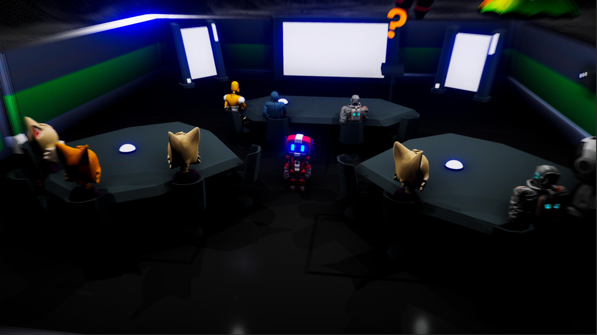
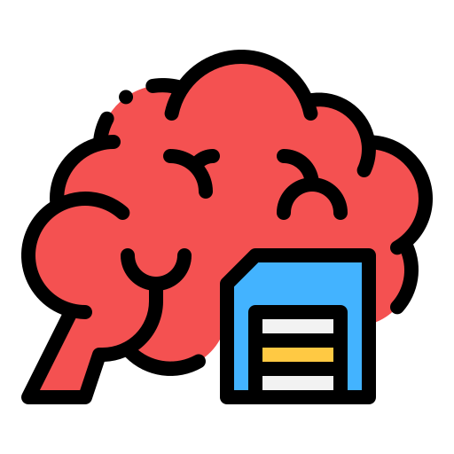
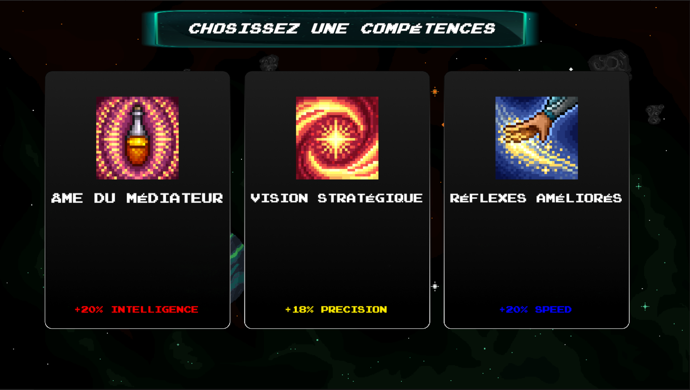
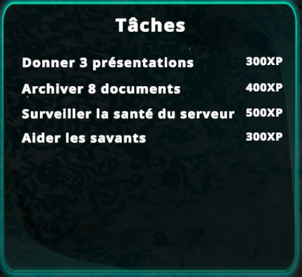
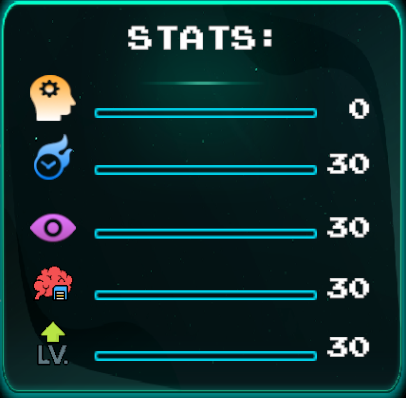
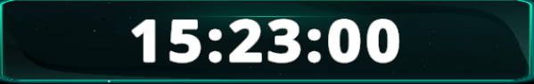
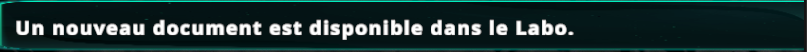
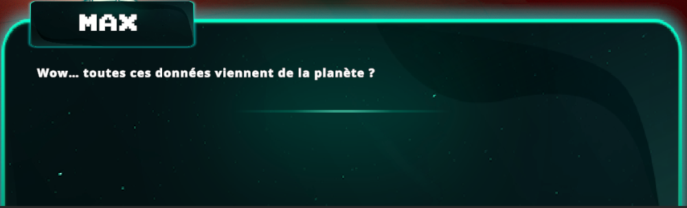

# **Description du Projet T3 - Crash Bandibooks**

## **Objectifs Pédagogiques**

Le jeu **Crash Bandibooks** a été conçu pour répondre à plusieurs objectifs pédagogiques, centrés sur la découverte
et la compréhension du rôle d'un **Data Librarian**. 

Les objectifs spécifiques incluent :

- Familiariser les joueurs avec les tâches essentielles du métier, telles que :
    - **La collecte de données** : Identifier et extraire des informations pertinentes.
    - **La gestion des données** : Organiser, stocker et structurer les informations pour une utilisation efficace.
    - **L'analyse des données** : Interpréter les informations collectées afin de prendre des décisions éclairées.

- Simuler un environnement de travail collaboratif où le **Data Librarian** interagit avec une équipe de chercheurs.

- Mettre en avant l’importance de la précision et de l’organisation dans le traitement des données pour résoudre des
problèmes complexes.

---

## **Description du Jeu**

**Crash Bandibooks** est un **jeu sérieux** de type **simulation et exploration**.

Le joueur incarne un **Data Librarian** intégré à une équipe de chercheurs en mission spatiale.
L’objectif est de collecter, analyser et organiser des données essentielles sur des matériaux découverts sur
des planètes. Ces données servent à résoudre des problèmes complexes pour assurer la réussite des missions scientifiques.

Le gameplay se concentre sur la gestion des données, les interactions sociales avec l’équipe,
et l’amélioration des compétences du personnage à travers différentes salles et activités.

---

## **Gameplay : Actions et Salles**

### **Actions du Joueur**

Le joueur peut :

- **Ajouter des métadonnées aux documents** pour structurer les données collectées.
- **Mettre en forme les documents** pour corriger les erreurs et les optimiser.
- **Se déplacer entre les salles** pour accomplir des tâches spécifiques :
    - Conférence, analyse, stockage ou gestion des données.
- **Interagir avec d'autres personnages** via une boîte de dialogue située en bas de l’écran.
- **Augmenter ses statistiques** pour améliorer ses performances dans les missions, en montant de niveau.

### **Les Salles**
Le jeu comporte plusieurs salles interconnectées :

1. **Le Bureau** :
    - Contient différents postes de travail.
    - Chaque poste est dédié à une tâche spécifique, comme l'ajout de métadonnées ou la mise en forme des documents.
     
    
     
   
2. **La Salle de Conférence** :
    - Permet de présenter les résultats et d’améliorer la statistique **Mémoire**.
    - Cruciale pour des interactions pédagogiques et des échanges avec d’autres membres de l’équipe.
     
    
     

3. **Le Laboratoire** :
    - Zone où les données brutes collectées par les scientifiques sont récupérées pour traitement.
       
      
       

4. **La Bibliothèque** :
    - Endroit dédié au dépôt et à l’organisation des données après leur traitement.
       
      
       

5. **La Salle des Serveurs** :
    - Permet de stocker les données importantes pour les missions futures.
    - Joue un rôle clé dans la gestion à long terme des informations.
       
      
       

---

## **Les Statistiques du Joueur**

Les statistiques du joueur influencent ses performances et sa progression :

- **Mémoire**  :
    - Représente la capacité à organiser et expliquer les informations.
    - Une mémoire élevée améliore les présentations en salle de conférence.
       

- **Intelligence**  :
    - Reflète la capacité à résoudre des problèmes et à améliorer la qualité des documents.
    - Une intelligence élevée aide à réparer les serveurs et résoudre des pannes techniques.
       

- **Vitesse**  :
    - Détermine la rapidité du joueur à accomplir les tâches et à se déplacer.
    - Utile pour respecter les délais et gérer les missions chronométrées.

- **Précision**  :
    - Représente la capacité à accomplir les tâches sans erreur.
    - Une précision élevée garantit des résultats fiables et une meilleure efficacité.
  
- **Niveau d'expérience**  :
    - Représente l'avancée du joueur dans le jeu
    - Chaque montée en niveau augmente les statistiques du joueur, 
  améliorant ainsi son efficacité dans toutes les tâches et donne accès au choix d'une nouvelle compétence.

---

## **Choix d'une compétence**

Lorsque le joueur augmente de niveau, une nouvelle interface apparait à l'écran.
Elle permet de choisir entre 3 compétences qui lui apporterons des avantages au cours de sa partie.

---

## **Interfaces**

Le jeu fournit des informations essentielles via plusieurs interfaces :

1. **En haut à gauche** :
    - Liste des tâches à accomplir.
       
      
       

2. **En haut à droite** :
    - Statistiques du joueur : Mémoire, Intelligence, Vitesse, Précision, et Niveau d'expérience.
       
      
       

3. **Au centre haut** :
    - Un chronomètre indique la durée de la session de jeu.
       
      
       

4. **À droite** :
    - Une boîte d'affichage liste les événements en cours (création de documents, fin d’analyse, etc.).
       
      
       
   
5. **En bas** :
    - Une boîte de dialogue permet d’interagir avec les autres personnages.
       
      
       

---
